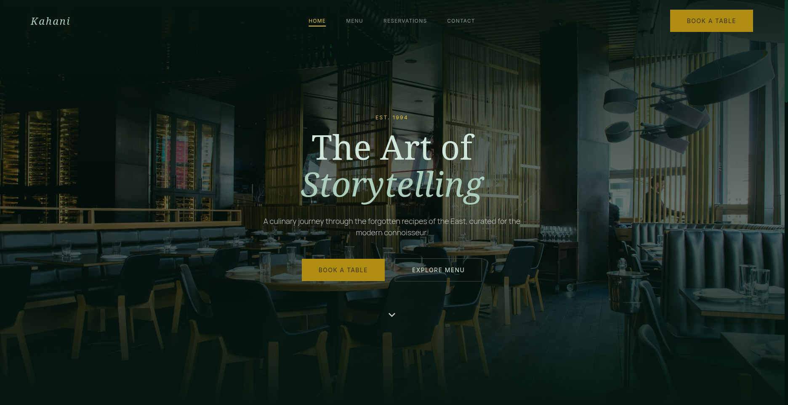
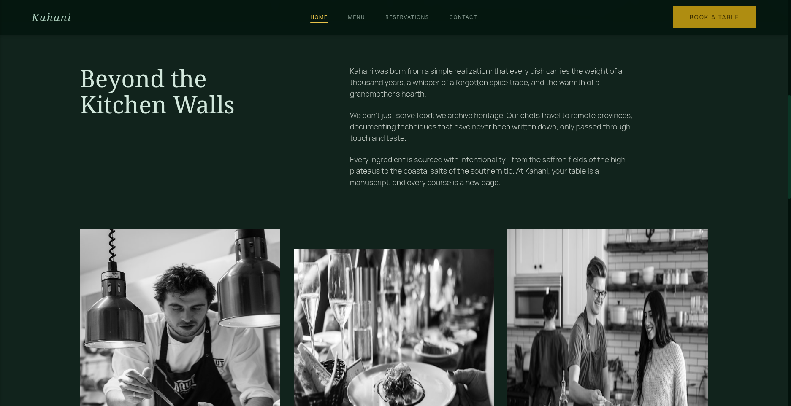
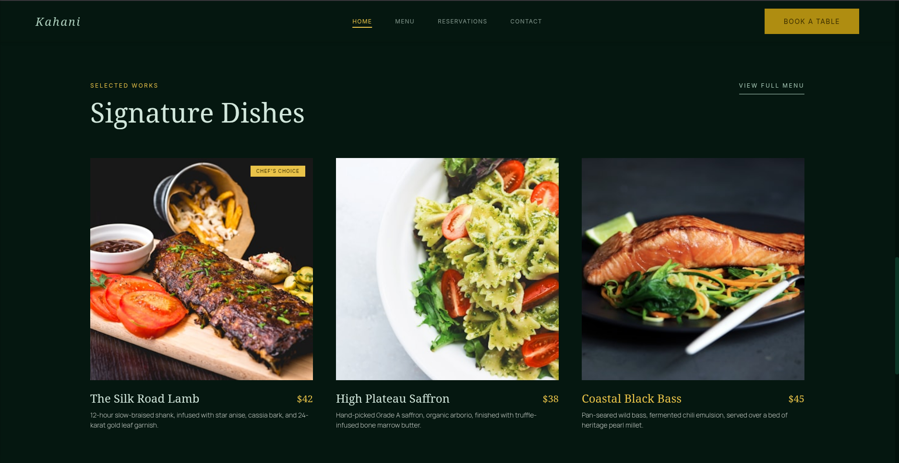
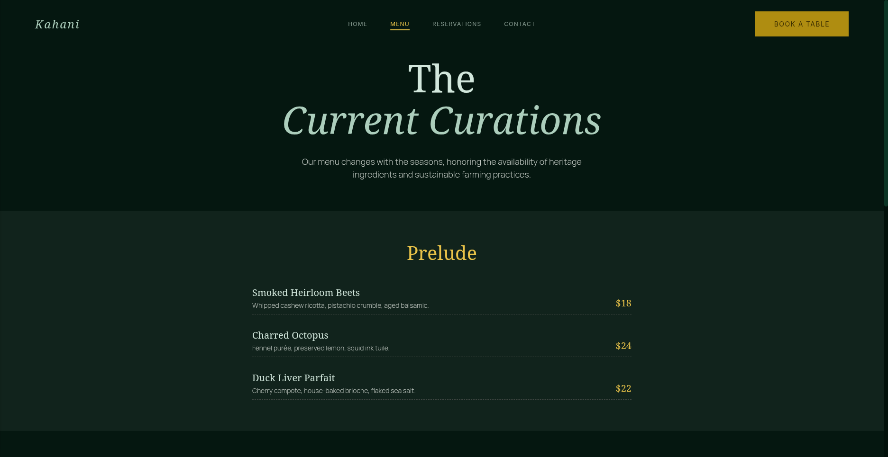
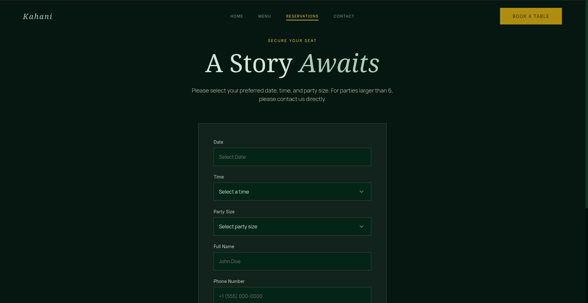
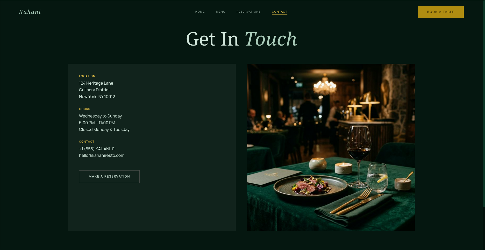

# Kahani Restaurant

A premium, highly-performant static website for a luxury dining experience. Rebuilt from the ground up using a modular Vanilla CSS architecture to guarantee flawless performance, eliminate layout cumulative shifts, and provide smooth, high-end animations without the overhead of heavy CSS frameworks.

## 🚀 Features

- **Premium UI/UX:** Dark-mode editorial design language tailored for modern luxury dining.
- **Custom CSS Architecture:** No Tailwind, no bulky libraries. Fully custom-authored, token-based Vanilla CSS utilizing native CSS variables for scalability.
- **Performance Optimized:** Lightning-fast page loader, immediate paint reveals, and optimized frame rates for menu scrolling.
- **Micro-Interactions:** Subtle hover states, breathing pulse animations on loading screens, and smooth scroll reveals as elements enter the viewport.
- **Integrated Datepicker:** Fully themed `Flatpickr` integration for the reservations calendar to match the dark luxury aesthetic.
- **Fully Responsive:** Fluid scaling on mobile, tablet, and ultra-wide monitor views.
- **Micro-animations:** Smooth fades, slide reveals, and breathing pulse animations on loading.

## 📸 Previews

### Desktop View (Homepage)
<p align="center">
  
  
  
</p>

### Inner Pages
<p align="center">
  
  
  
</p>

## 📁 Project Structure

The project relies on a strictly decoupled folder architecture:
- **HTML Pages** (`index.html`, `menu.html`, `reservations.html`, `contact.html`) to manage raw document structure and SEO.
- **CSS Design System** (`css/`) divided into specialized files:
  - `variables.css` (Core Design Tokens: Colors, Typography, Easing)
  - `reset.css` (Modern element reset)
  - `layout.css` (Grid, Flexbox, & Container outlines)
  - `components.css` (Scalable UI: Navbar, Buttons, Forms, overriding native browser styles)
  - `animations.css` (Keyframes, loader transition logic, and scroll reveals)
- **Javascript Logic** (`js/main.js`) handling the minimalist interactions for the mobile menu, scroll spying, and load delays.

## 🛠️ Tech Stack

- **HTML5** (Semantically Structured)
- **Vanilla CSS3** (Modular Design System)
- **Vanilla JS** (Zero core dependencies)
- **Flatpickr** (Lightweight JS library uniquely styled for the reservation date management)

## 💻 How to Run Locally

Because the project is entirely composed of static assets, you can view the website instantly without complicated build steps:

1. Clone or download the repository.
2. Navigate into the main project directory.
3. Because the HTML files reference local CSS/JS, you can simply double-click any of the HTML pages (such as `index.html`) to open them natively in your browser.

**Running a Local Server:**
If you prefer viewing it over a localized port for precise testing:

```bash
# Using Python
python3 -m http.server 8000

# Using Node (if serve is installed)
npx serve .
```
Visit `http://localhost:8000` in your browser.

## 📜 Design Philosophy
The principle behind **Kahani** is that "every dish carries the weight of a thousand years." The user interface was meticulously constructed to reflect this narrative depth—using vast negative space, elegant typography (`Noto Serif` for headings, `Manrope`/`Inter` for reading parameters), and muted, grayscale storytelling photography that dynamically blossoms into full color upon user interaction.
