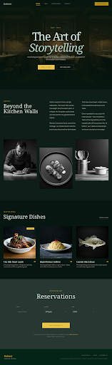

# 🍽️ Kahani Restaurant — Signature Editorial
### *Experience the Art of Storytelling Through Cuisine*



Kahani is a premium, story-driven restaurant website designed for the modern connoisseur. It captures the essence of heritage recipes and transforms them into a digital editorial experience, featuring a sophisticated dark theme, smooth interactivity, and an elegant layout.

---

## ✨ Key Features

- **📖 Narrative Experience** – A journey through Chapter-based storytelling of the restaurant's origin and culinary philosophy.
- **📱 Responsive & Interactive** – Fully optimized for mobile, tablet, and desktop viewing with custom-built drawer menus.
- **🍷 Curated Menus** – Beautifully presented signature dishes and full-course menu listings.
- **📅 Seamless Reservations** – Integrated reservation system with custom date-picking UI (powered by Flatpickr).
- **✨ Premium Animations** – Scroll-based reveal effects, parallax imagery, and glassmorphism elements for a modern feel.
- **🎨 Dark Design System** – A curated color palette of deep greens and metallic accents (Saffron/Gold).

---

## 🛠️ Tech Stack & Design

### Core Technologies


### Typography & Assets
- **Headlines:** *Noto Serif* (Classic, Editorial feel)
- **Body & Labels:** *Manrope* & *Inter* (Modern, Legible, Professional)
- **Icons:** *Material Symbols Outlined*

---

## 📁 Project Architecture

```text
Kahani-Restaurant/
├── assets/
│   ├── css/           # Design system and custom styles
│   ├── images/        # High-res culinary photography & screenshots
│   └── js/            # Main interactivity and component logic
├── website/           # Application pages
│   ├── index.html     # Homepage & Our Story
│   ├── menu.html      # Menu listings
│   ├── reservations.html # Booking flow
│   └── contact.html   # Location & Support
└── readme.md          # Project documentation
```

---

## 🚀 Getting Started

To explore the Kahani experience locally, follow these steps:

1. **Clone the project**
   ```bash
   git clone https://github.com/jaymakwanaooz/Kahani-Restaurant.git
   cd Kahani-Restaurant
   ```

2. **Open the site**
   Simply open `/website/index.html` in your preferred modern web browser.

---

## 🎨 Design Philosophy
The "Signature Editorial" design system uses a dark palette (`#051710` background) to evoke a sense of intimacy and luxury. By combining high-contrast typography with spacious layouts, Kahani positions itself not just as a dining destination, but as a manuscript of taste.

---

## 📄 License
This project is for demonstration and educational purposes as part of the Kahani Signature Editorial portfolio.

---
*Created by Jay Makwana*
